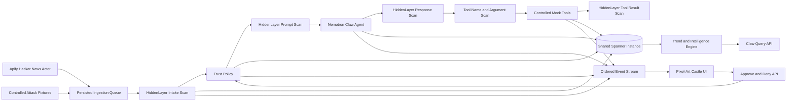

# Hidden Tower Defence — End-to-End Implementation, Delivery, and Launch Plan

## Document status

- Status: Ready for implementation
- Target environment: Production-only incubation
- Primary cloud: Google Cloud Platform
- Primary region: `us-central1`
- Runtime: Cloud Run
- Last reviewed: 2026-07-18

This document is the durable implementation and delivery plan for Hidden Tower
Defence. It incorporates the original requirements in `IMPLEMENTATION_PLAN.md`
and the architecture, integration, cloud, CI/CD, persistence, domain, and
product decisions validated during planning.

## 1. Decisions that supersede the original plan

The original plan remains the source for the autonomous security workflow and
castle demo requirements. The following decisions supersede its portable-only
cloud boundary:

1. GCP is the selected cloud provider.
2. Cloud Run is the production runtime.
3. Production persistence uses Cloud Spanner rather than SQLite.
4. A new `hiddentowerdefence` database will be created in the existing shared
   `smp-prod-shared-spanner` instance.
5. Local and CI integration testing will use the Cloud Spanner emulator.
6. The default Apify Actor is `gentle_cloud/hacker-news-scraper`.
7. `onescales/hacker-news-data` is the fallback Actor.
8. The product includes a functional developer-market intelligence capability,
   not only a security visualization.
9. Terraform, GCP delivery configuration, GitHub Actions, DNS delegation, and
   production observability are now in scope.

## 2. Product objective

Hidden Tower Defence is a secure autonomous intelligence platform. It monitors
developer-community conversations, turns untrusted content into structured
intelligence, and visibly demonstrates how an agent remains protected at every
model and tool boundary.

The initial source is Hacker News. The product will:

- Ingest recent stories and selected comments.
- Detect prompt injection and other malicious content.
- Summarize and categorize relevant stories.
- Extract companies, products, technologies, repositories, and vulnerabilities.
- Identify emerging topics and developer sentiment.
- Produce intelligence briefs and controlled alert drafts.
- Answer natural-language questions about recent developer-market trends.
- Cite the source evidence behind every trend claim.
- Display the security workflow through a live pixel-art castle.

Initial trend results must be labeled as Hacker News or developer-community
signals. They must not be represented as complete market-wide evidence until
additional independent sources are added.

## 3. User-facing use case

A user can ask the Claw intelligence agent questions such as:

- What AI-agent security trends emerged over the past seven days?
- Which developer tools are gaining attention?
- What complaints are appearing around a competitor?
- Has discussion of prompt injection increased?
- Which new projects have unusually positive engagement?

The response will include:

- Ranked trends.
- Current-period and prior-period evidence counts.
- Engagement and sentiment changes.
- Related companies, products, and technologies.
- Supporting Hacker News stories and comments.
- Confidence based on evidence volume.
- Suggested follow-up actions.

Deterministic application logic and Spanner queries calculate counts, time
windows, and comparisons. Nemotron explains those results; it must not invent
the underlying measurements.

## 4. High-level architecture



## 5. End-to-end processing flow

### 5.1 Ingestion

1. A 15-second heartbeat coordinates pending work.
2. Every 120 seconds, the source adapter starts an asynchronous Apify run when
   no active source run already exists.
3. Production input defaults:
   - Actor: `gentle_cloud/hacker-news-scraper`
   - Mode: `new`
   - Maximum results: 10–20
   - Include comments: true
4. The exact Apify run ID is persisted and polled to a terminal state.
5. Dataset output is normalized into a source-independent content model.
6. Every item is persisted before security or model processing.
7. Hacker News items use `hn:{id}` as their deduplication key.

The source adapter must tolerate Actor schema changes and support the configured
fallback Actor through a separate normalization profile.

### 5.2 Security and trust evaluation

HiddenLayer scans five boundaries:

1. Ingested title, story text, and selected comments.
2. The completed prompt before sending it to Nemotron.
3. Nemotron's response.
4. A requested tool name and its arguments.
5. A tool result before it can return to the model.

Raw responses are retained for auditability. The application normalizes them
into:

- Detection status
- Threat level
- Recommended action
- Detector names
- Raw findings

Trust policy:

- `NORMAL`: controlled tools may execute.
- `RESTRICTED`: analysis may continue, but writes and outbound actions require
  operator approval.
- `LOCKED`: raw content is withheld from Nemotron and tool execution stops.

Low/medium findings, HiddenLayer `Alert` responses, ambiguous results, and
configured fail-closed conditions enter `RESTRICTED`. High/critical findings or
blocking responses enter `LOCKED`.

Flagged source IDs remain tainted until explicitly resolved. A later clean scan
does not silently clear taint.

### 5.3 Nemotron intelligence work

For allowed content, Claw/Nemotron returns validated structured output:

- Summary
- Category
- Priority
- Sentiment
- Topics and named entities
- Companies, products, repositories, and CVEs where present
- Relevance to configured watchlists
- Recommended controlled tool action
- Concise rationale

Model temperature is zero. Invalid structured output receives one repair
attempt and then fails safely.

### 5.4 Controlled tools

Initial tools are deliberately non-destructive:

- `save_brief`: persists an intelligence brief.
- `draft_alert`: writes to a mock outbox and never sends real email.
- `quarantine_item`: records quarantine state.
- `mock_web_fetch`: returns controlled fixture content for result scanning.

Restricted tool calls become approval records. Approval executes the deferred
mock action; denial quarantines it without execution.

### 5.5 Intelligence and trend generation

Enriched history supports:

- Rolling topic and entity counts.
- Current-period versus previous-period comparisons.
- Engagement changes.
- Sentiment movement.
- Related-story clustering.
- Watchlist matches.
- Evidence-backed trend confidence.

The first version should use transparent structured aggregation. Semantic
embeddings or vector search are optional later enhancements, not launch
requirements.

## 6. Persistence architecture

### 6.1 Shared-instance model

Production uses:

- Project: `smp-shared-prod`
- Instance: `smp-prod-shared-spanner`
- Instance configuration: regional `us-central1`
- Existing capacity: 100 processing units
- New database: `hiddentowerdefence`

The new database shares the existing instance compute capacity. It does not
create another independently billed Spanner instance. Separate databases
provide schema and operational isolation while retaining the shared-compute
cost model.

### 6.2 Logical schema

The schema will cover:

- Runtime state and heartbeat leases
- Source items and comments
- Apify runs
- Raw and normalized HiddenLayer scans
- Trust transitions and taint records
- Nemotron triage results
- Topics and entities
- Watchlists and watchlist matches
- Trend snapshots and signals
- Deferred approvals
- Incidents
- Intelligence briefs
- Mock outbox entries
- Ordered UI events
- Schema migration history

Transactions must protect:

- Trust-state transitions
- Approval resolution
- Taint changes
- Deduplication
- Event sequence allocation
- Persist-before-process guarantees

The Python Spanner client performs synchronous I/O. All database operations
must run through bounded worker threads so they never block FastAPI's event
loop.

### 6.3 Schema lifecycle

- Database creation and deletion protection are managed by Terraform.
- Schema changes use versioned, forward-compatible migrations.
- Migrations are additive by default.
- A release must not require an immediate destructive migration.
- Rollback restores an earlier application image without reversing compatible
  schema additions.

## 7. Backend components

Planned modules:

```text
app/
  main.py
  config.py
  models.py
  events.py
  heartbeat.py
  policy.py
  orchestrator.py
  intelligence.py
  trends.py
  repositories/
    spanner.py
  migrations/
  clients/
    apify.py
    hiddenlayer.py
    nemotron.py
  sources/
    apify_source.py
    demo_source.py
  agent/
    prompts.py
    tools.py
  static/
    index.html
    app.js
    styles.css
fixtures/
tests/
infra/
```

Configuration accepts the supplied Cursor secret names and normalized
deployment aliases. The implementation must never expose credentials through
logs, exceptions, API responses, event payloads, or frontend state.

## 8. API surface

Security and operations:

- `GET /healthz`
- `GET /readyz`
- `GET /api/state`
- `POST /api/heartbeat/run`
- `GET /api/events`
- `WS /ws/events`

Approvals and incidents:

- `GET /api/approvals`
- `POST /api/approvals/{id}/approve`
- `POST /api/approvals/{id}/deny`
- `POST /api/incidents/{id}/acknowledge`
- `POST /api/state/resume`

Demo controls:

- `GET /api/demo/fixtures`
- `POST /api/demo/fixtures/{id}/inject`

Intelligence:

- `GET /api/briefs`
- `GET /api/trends`
- `GET /api/watchlists`
- `POST /api/watchlists`
- `POST /api/intelligence/query`

Mutating routes require the operator token in production. Browser calls remain
same-origin.

## 9. Pixel-art castle frontend

The castle is a first-class product demo surface. It translates authoritative
backend events into deterministic animations; it does not make policy
decisions.

### 9.1 Visual event mapping

| Backend event | Castle representation |
| --- | --- |
| Content received | A traveler approaches the castle |
| Input scan starts | Guards inspect the traveler |
| Clean content | The gate opens and a citizen enters |
| Nemotron starts | The castle keep lights up |
| Model output completes | A messenger exits carrying a scroll |
| Tool requested | A worker walks toward a workshop |
| Tool completed | The worker returns with the result |
| Restricted or alert | A cloaked traveler is held at the gate |
| Approval created | Approve and Deny controls appear |
| Approved | Guards open the gate |
| Denied | Guards escort the traveler to quarantine |
| High or critical threat | The traveler becomes an enemy |
| Blocked or locked | The gate closes and tower crossbows fire |
| Incident created | Alarm beacons and red banners activate |
| Heartbeat | The castle flag or watchtower pulses |

### 9.2 Layout

- Central low-resolution Canvas scaled with pixel rendering.
- Castle, gate, towers, guards, citizens, enemies, arrows, and messengers.
- Visible `NORMAL`, `RESTRICTED`, or `LOCKED` trust-state banner.
- Operations panel containing the ordered event history.
- Selected-entity panel showing the source, scan boundary, HiddenLayer
  decision, Nemotron result, and tool action.
- Gate approval controls.
- Buttons for clean, restricted, high-risk, hidden-injection, and malicious
  tool-result fixtures.
- A compact Claw intelligence panel for natural-language trend queries.

### 9.3 Frontend behavior

- Plain HTML, CSS, JavaScript, and Canvas.
- Code-generated shapes and sprites; no external assets.
- Stable entity-to-event association.
- Clicking an entity displays its processing history.
- Automatic WebSocket reconnect.
- REST catch-up from the last received event ID.
- Reload restores active approvals, incidents, trust state, and missed events.
- Raw content is rendered as text, never injected as HTML.
- Accessible text status and controls remain available outside the Canvas.

## 10. Verification strategy

### 10.1 Automated tests

- Trust-state transitions and de-escalation
- Approval and denial behavior
- Tool blocking
- Taint propagation
- Actor output normalization and deduplication
- Exact Apify run polling
- HiddenLayer response normalization
- Nemotron malformed-output repair
- Spanner transaction behavior
- Persistence across restart
- Event ordering and replay
- Trend aggregation
- Evidence citations
- REST and WebSocket behavior
- Operator authentication
- Graceful shutdown

### 10.2 Local integration

Local development uses the Cloud Spanner emulator. One documented command
starts the emulator and application together. Tests must not require production
credentials unless explicitly running the live integration suite.

### 10.3 Live integration checks

Live checks are bounded and must never print secrets:

- Apify run with no more than three items
- One clean HiddenLayer scan
- One adversarial HiddenLayer scan
- One minimal Nemotron completion

Validated planning results:

- The configured Apify token can execute Actors.
- `gentle_cloud/hacker-news-scraper` completed a three-item run with comments.
- `onescales/hacker-news-data` completed a three-item fallback run.
- HiddenLayer OAuth, clean scanning, and adversarial detection succeeded.
- Nemotron returned a successful completion.

## 11. Production cloud architecture

### 11.1 Runtime

- GCP project: `smp-shared-prod`
- Region: `us-central1`
- Runtime: one Cloud Run service
- Initial hostname: generated `run.app` URL
- Container user: non-root
- CPU: always allocated
- Minimum instances: 1
- Maximum instances: 1
- WebSocket-compatible request timeout
- Graceful shutdown through FastAPI lifespan

Always-allocated CPU and one minimum instance are required for the 15-second
background heartbeat. A single maximum instance avoids duplicate heartbeat
workers and cross-instance WebSocket delivery during the MVP.

Horizontal scaling is a later architecture change. It requires moving heartbeat
coordination to a dedicated worker or distributed lease and adding a shared
event fan-out mechanism.

### 11.2 Artifact and state

- Artifact Registry: existing `shared-platform-images`
- Terraform state bucket: `smp-substrate-tfstate-prod`
- State prefix: `products/hiddentowerdefence/prod`
- Images are deployed by immutable digest, never a mutable tag alone.

### 11.3 Service identities

Use separate identities:

- CI deploy service account
- Runtime service account

The runtime identity receives only the Spanner, Secret Manager, logging, and
monitoring permissions required by the application. CI receives only the
registry, Cloud Run, Terraform state, migration, and service-account
impersonation permissions required for delivery.

## 12. Secrets

Verified source credentials are available for:

- Apify
- HiddenLayer
- NVIDIA
- GCP bootstrap
- Porkbun

Production Secret Manager resources:

- `secret--hiddentowerdefence--prod--apify-api-token`
- `secret--hiddentowerdefence--prod--hiddenlayer-client-id`
- `secret--hiddentowerdefence--prod--hiddenlayer-client-secret`
- `secret--hiddentowerdefence--prod--nvidia-api-key`
- `secret--hiddentowerdefence--prod--operator-token`

Secret values are provisioned out of band and never stored in Terraform state.
The operator token is generated securely during deployment handoff.

The available GCP service-account credential is bootstrap-only. Steady-state
CI uses GitHub OIDC and Workload Identity Federation without long-lived cloud
keys.

## 13. Terraform scope

Terraform manages:

- Spanner database and deletion protection
- Runtime and CI service accounts
- Least-privilege IAM bindings
- GitHub Workload Identity Federation provider
- Cloud Run service
- Secret Manager resources and access bindings
- Artifact Registry access
- Logging and monitoring resources
- Cloud DNS managed zone
- Static external IP
- HTTPS load balancer and backend
- Cloud Armor baseline
- Certificate Manager resources

Terraform must not contain runtime secret values.

## 14. CI/CD

### 14.1 Pull-request workflow

Every pull request runs:

1. Locked dependency installation.
2. Ruff formatting and linting.
3. Static type checking.
4. Unit tests.
5. Spanner-emulator integration tests.
6. REST, WebSocket, startup, and shutdown smoke tests.
7. Production container build.
8. Container vulnerability scan.
9. Terraform formatting and validation.
10. Infrastructure policy checks.
11. Terraform plan without apply.

Normal pull-request tests mock third-party providers.

### 14.2 Main-branch production workflow

Pushes to `main`:

1. Authenticate to GCP through GitHub OIDC/WIF.
2. Run backward-compatible Spanner migrations.
3. Build the production image once.
4. Push the image to Artifact Registry.
5. Capture the immutable image digest.
6. Apply Terraform with that digest.
7. Verify health, readiness, API, WebSocket, and Spanner access.
8. Run bounded post-deployment provider checks where appropriate.
9. Record release metadata and the deployed digest.
10. Scan startup logs for errors.

Terraform applies use a concurrency group and cannot overlap.

### 14.3 Scheduled live verification

A separate scheduled or manually triggered workflow runs:

- Bounded Apify ingestion
- Clean and adversarial HiddenLayer probes
- Minimal Nemotron completion
- Trend-generation smoke test

This prevents paid or externally flaky checks from destabilizing normal pull
requests.

### 14.4 Rollback

A manual rollback workflow:

1. Selects a previous release digest.
2. Reapplies that digest.
3. Leaves backward-compatible schema additions in place.
4. Repeats health and application smoke tests.
5. Records rollback evidence.

## 15. Domain and TLS rollout

Porkbun remains the registrar. The rollout delegates authoritative DNS to
Google Cloud DNS; it is not a registrar transfer.

Porkbun API authentication, DNS retrieval, and nameserver retrieval have been
validated. No nameserver mutation occurred during planning.

Domain rollout:

1. Record current nameservers and DNS records for rollback.
2. Create the Cloud DNS managed zone.
3. Copy required existing records before delegation, including mail-related MX
   and TXT records.
4. Provision the load balancer, static IP, and certificate resources.
5. Update Porkbun nameservers.
6. Start durable delegation and certificate monitoring.
7. Verify authoritative nameservers from public resolvers.
8. Verify DNS propagation.
9. Verify managed certificate activation.
10. Verify HTTPS health.
11. Enable the production hostname only after all checks pass.

The Cloud Run URL remains the working application URL throughout propagation.
Domain readiness does not block application implementation, CI/CD, or the
initial production deployment.

The monitor must be resumable and idempotent. A scheduled GitHub workflow will
recheck delegation, certificate, and HTTPS state until completion while the
implementation proceeds independently.

## 16. Observability

Use structured JSON logging and OpenTelemetry-compatible attributes for:

- Product
- Environment
- Service
- Source item
- Apify run
- Security scan boundary
- Trust state
- Incident
- Release digest

Metrics and alerts cover:

- Heartbeat health and duration
- Pending processing count
- Apify run failures and schema drift
- HiddenLayer latency, detections, and errors
- Nemotron latency and invalid responses
- Trust-state changes
- Pending approvals
- Unresolved incidents
- Trend-generation latency
- WebSocket connections and reconnects
- Spanner latency and transaction failures
- Deployment health

The health endpoint checks process liveness. Readiness separately checks
Spanner and required application initialization without making every request
dependent on third-party provider availability.

## 17. Implementation sequence

### Stage 1 — Specification and foundation

- Reconcile the original plan with this document.
- Create Python project scaffolding and locked dependencies.
- Implement configuration, logging, health, readiness, and container startup.
- Add non-root production Docker image and local emulator harness.

### Stage 2 — Persistence

- Create versioned Spanner schema.
- Implement repositories and transactions.
- Implement event sequence allocation.
- Implement startup recovery and heartbeat leases.

### Stage 3 — Provider integrations

- Implement and test Apify primary/fallback profiles.
- Implement HiddenLayer OAuth and scan normalization.
- Implement Nemotron structured output and repair.

### Stage 4 — Security orchestration

- Implement trust policy and taint tracking.
- Implement approvals, incidents, and controlled tools.
- Enforce all five scan boundaries.

### Stage 5 — Intelligence functionality

- Implement enrichment persistence.
- Implement watchlists.
- Implement trend aggregation and comparison.
- Implement evidence-backed Claw queries.
- Implement briefs and mock alerts.

### Stage 6 — Frontend

- Implement REST and WebSocket surfaces.
- Build deterministic castle animation.
- Build approvals, operations, selected-entity, and intelligence panels.
- Verify reconnect and event replay.

### Stage 7 — Verification and hardening

- Complete automated test coverage.
- Run bounded live provider tests.
- Verify restart recovery.
- Verify credential redaction and input safety.
- Validate production image and graceful shutdown.

### Stage 8 — Cloud and delivery

- Provision WIF, identities, secrets, Spanner database, and Cloud Run.
- Add CI, deployment, live verification, and rollback workflows.
- Deploy by image digest.
- Run production smoke tests.

### Stage 9 — Domain activation

- Create and populate Cloud DNS.
- Begin nameserver delegation monitoring while the GCP URL remains active.
- Activate the custom hostname after DNS, TLS, and HTTPS verification.

## 18. Risks and mitigations

| Risk | Mitigation |
| --- | --- |
| Apify Actor schema changes | Configurable Actor ID, separate normalization profiles, fallback Actor |
| External API outage | Timeouts, bounded retries, persisted work, safe recovery |
| Malicious comments or tool results | Five HiddenLayer scan boundaries and taint propagation |
| Model hallucinated trend claims | Deterministic aggregation, citations, evidence counts, scope labels |
| Background work pauses on Cloud Run | Minimum one instance and always-allocated CPU |
| Duplicate heartbeat processing | Single instance plus persisted lease and transaction checks |
| Spanner client blocks event loop | Bounded worker-thread execution |
| Browser disconnect loses events | Persisted ordered events and REST catch-up |
| Domain propagation delays launch | Use `run.app` URL and asynchronous domain monitor |
| DNS delegation disrupts mail | Copy and verify MX/TXT records before nameserver change |
| Destructive migration blocks rollback | Additive migrations and digest-based application rollback |
| Secret exposure | Secret Manager, redaction, no secret values in state or artifacts |

## 19. Completion criteria

Implementation is complete when:

1. Local development starts with one documented command.
2. Clean Hacker News content reaches Nemotron and produces persisted
   intelligence.
3. All five HiddenLayer boundaries are exercised.
4. Restricted actions visibly wait at the castle gate.
5. Approval opens the gate and denial quarantines the item.
6. High-severity content locks the agent and triggers the crossbow animation.
7. Tool-result injection is blocked before returning to Claw.
8. Users can query recent developer-market trends with cited evidence.
9. Refresh and process restart preserve state, approvals, incidents, and events.
10. Pull-request CI passes all required gates.
11. Production deploys through WIF using a digest-pinned image.
12. Production health, API, WebSocket, Spanner, and provider smoke tests pass.
13. A previous release can be restored through the rollback workflow.
14. The Cloud Run URL works independently of domain propagation.
15. DNS delegation and TLS monitoring activate `hiddentowerdefence.com` only
    after verified readiness.
16. README and operator documentation explain setup, architecture, demo flow,
    intelligence use case, deployment, rollback, and sponsor rationale.
