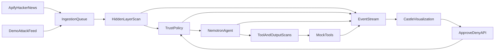

# Hidden Tower Defence — One-Shot Implementation Plan

Implement a cloud-ready hackathon MVP containing the autonomous backend and a minimal pixel-art visualization. Do not select or configure a cloud provider yet; provide a portable Docker image, health endpoint, persistent-data path, and deployment documentation for the next agent.

## Core architecture



## Technology

- Python 3.12
- FastAPI with lifespan-managed heartbeat task
- SQLite through `aiosqlite`
- `httpx` for HiddenLayer and Apify
- OpenAI Python client for NVIDIA
- Plain HTML, CSS, JavaScript, and Canvas; no frontend build system
- `uv` for dependencies
- Pytest, pytest-asyncio, respx, Ruff

## Configuration

Accept both the supplied Cursor secret names and normalized deployment aliases:

- `APIFY_API_TOKEN`
- `HiddenLayer_API_ClientID` or `HIDDENLAYER_CLIENT_ID`
- `HiddenLayer_API_ClientSecret` or `HIDDENLAYER_CLIENT_SECRET`
- `NVIDIA_nemotron-3-ultra-550b-a55b_API_KEY` or `NVIDIA_API_KEY`

Defaults:

- HiddenLayer base URL: `https://api.hiddenlayer.ai`
- NVIDIA base URL: `https://integrate.api.nvidia.com/v1`
- NVIDIA model: `nvidia/nemotron-3-ultra-550b-a55b`
- Apify Actor: `epctex/hackernews-scraper`
- Heartbeat: 15 seconds
- Apify interval: 120 seconds
- SQLite path: configurable through `DATA_DIR`
- Actor input: `NEWEST`, 10–20 items, comments enabled

Never expose or log credentials. Add `.env.example`, but never create a populated `.env`. Cursor agent secrets must later be configured separately in the deployed runtime.

## Repository structure

```text
app/
  main.py
  config.py
  models.py
  database.py
  events.py
  heartbeat.py
  policy.py
  orchestrator.py
  clients/
    apify.py
    hiddenlayer.py
    nemotron.py
  sources/
    apify_source.py
    demo_source.py
  agent/
    prompts.py
    tools.py
  static/
    index.html
    app.js
    styles.css
fixtures/
  attack_feed.json
tests/
Dockerfile
pyproject.toml
.env.example
.gitignore
README.md
```

## Implementation requirements

### 1. Persistent heartbeat harness

- Start one background heartbeat from the FastAPI lifespan.
- Prevent overlapping heartbeat executions.
- Recover pending content, active Apify runs, trust state, approvals, and incidents after restart.
- Persist source items before processing them.
- Use Hacker News IDs as `hn:{id}` deduplication keys.
- Store active Apify run IDs and poll those exact runs instead of querying “latest run.”
- Never block the event loop with synchronous network or database work.

### 2. Ingestion sources

Implement two adapters feeding the same queue:

1. Apify source:
   - Start the configured Actor asynchronously.
   - Poll until a terminal state.
   - Fetch `defaultDatasetId` items.
   - Normalize mode-dependent output into a common content model.
   - Handle failed, timed-out, duplicate, and malformed runs safely.

2. Controlled attack source:
   - Load fixtures containing clean, low/medium manipulation, high-severity exfiltration, hidden mid-content injection, and malicious tool-result examples.
   - Use only fake canary data.
   - Expose endpoints to list and inject fixtures.
   - Clearly label fixture events as simulated input, while still sending them through the real security pipeline.

### 3. HiddenLayer integration

Authenticate using OAuth client credentials at `/oauth2/token`.

Create one `scan()` adapter supporting:

- Ingested content
- Prompt before Nemotron
- Nemotron response
- Tool name and arguments
- Tool result

Prefer the stable `/detection/v1/interactions` API. Preserve raw response JSON. Normalize findings into:

- `detected`
- `threat_level`
- `action`
- detector names
- raw findings

Before completing implementation, use the available credentials to perform one clean and one malicious integration probe. If the event account requires a different endpoint or schema, isolate that difference inside the adapter rather than spreading vendor-specific logic throughout the application.

Implement bounded timeouts, token caching, token refresh, retries for 408/409/429/5xx, and fail-closed behavior configurable through environment settings.

### 4. Trust policy

Implement:

- `NORMAL`: all mock tools available.
- `RESTRICTED`: low/medium finding; read operations allowed, writes and outbound actions deferred into the approval queue.
- `LOCKED`: high/critical finding or HiddenLayer `BLOCK`; tool execution halts.

Behavior:

- Restricted items may be analyzed, but unsafe tool requests remain deferred.
- Approve executes the deferred mock action and resolves the item.
- Deny quarantines it without execution.
- Locked items are not supplied raw to Nemotron. Generate an incident summary from detector metadata and a safely truncated/redacted excerpt.
- Acknowledge moves `LOCKED` down one level; require another explicit resume action to return to `NORMAL`.
- Log every transition with its reason.
- Track flagged source IDs so actions derived from unresolved tainted content remain blocked even if a later scan appears clean.

### 5. Nemotron agent work

Use Nemotron for real document/news triage:

- Summarize each item.
- Assign category and priority.
- Decide whether to save a brief or draft an alert.
- Request mock tools using structured output/tool calling.
- Use temperature zero.
- Validate all structured output.
- Add one repair retry, then fail safely without crashing.

Tools:

- `save_brief`: persist a summary.
- `draft_alert`: write to a mock outbox, never send real email.
- `quarantine_item`: persist quarantine status.
- `mock_web_fetch`: return controlled fixture content for tool-result scanning.

Scan prompts before calls, responses afterward, requested tool arguments before dispatch, and tool results before returning them to the model.

### 6. Database and event stream

Persist:

- Runtime trust state
- Source items and processing status
- Apify run state
- Raw and normalized scans
- State transitions
- Deferred approvals
- Incidents
- Mock outbox
- Ordered UI events

Stream ordered events over `/ws/events`. Include event IDs so reconnecting clients can retrieve missed events through a REST endpoint.

Important event types:

- `heartbeat`
- `content_received`
- `scan_started`
- `scan_completed`
- `detection`
- `state_changed`
- `model_started`
- `model_completed`
- `tool_requested`
- `tool_blocked`
- `tool_completed`
- `approval_created`
- `approval_resolved`
- `incident_created`

### 7. API surface

Implement:

- `GET /healthz`
- `GET /api/state`
- `GET /api/events`
- `GET /api/approvals`
- `POST /api/approvals/{id}/approve`
- `POST /api/approvals/{id}/deny`
- `POST /api/incidents/{id}/acknowledge`
- `POST /api/state/resume`
- `GET /api/demo/fixtures`
- `POST /api/demo/fixtures/{id}/inject`
- `POST /api/heartbeat/run`
- `WS /ws/events`
- `GET /` serving the frontend

Keep browser requests same-origin. Support an optional `OPERATOR_TOKEN`; require it for mutating endpoints when production mode is enabled.

### 8. Minimal castle frontend

Create a functional visualization without external assets:

- Draw a basic castle, gate, guards, citizens, enemies, and arrows using Canvas shapes.
- Clean content: citizen walks through the open gate.
- Restricted content: mystery traveler stops at guards and opens Approve/Deny controls.
- Locked content: traveler becomes an enemy, an arrow removes it, and the gate closes.
- Display current trust state.
- Include buttons for injecting each fixture.
- Include a raw operations panel showing event history and real HiddenLayer JSON.
- Clicking an animated traveler selects its associated event details.
- Reconnect the WebSocket automatically and recover missed events.

Keep animation deterministic and separate from backend policy logic.

### 9. Verification

Write tests for:

- All state transitions and de-escalations
- Approval and denial behavior
- Tool blocking
- Taint propagation
- Apify normalization and deduplication
- HiddenLayer response normalization
- Nemotron malformed-output repair
- Persistence across simulated restart
- Event ordering
- API and WebSocket smoke behavior

Run:

- Ruff
- Pytest
- Application startup smoke test
- Live Apify run with no more than three items
- One clean and one adversarial HiddenLayer scan
- One minimal Nemotron completion

Live tests must skip cleanly when credentials are unavailable and must never print secrets.

## Cloud-readiness boundary

Include:

- Multi-stage or minimal production Dockerfile
- Non-root runtime user
- `PORT` support
- `/healthz`
- Persistent `DATA_DIR`
- Graceful shutdown
- README deployment contract

Do not add Terraform, vendor-specific deployment files, DNS configuration, or configure `hiddentowerdefence.com`. A later deployment agent will choose the platform and provision runtime secrets, TLS, storage, and domain routing.

## Completion criteria

The work is complete when:

1. The service starts with one command.
2. Clean Hacker News content reaches Nemotron and produces persisted triage output.
3. Every required boundary is scanned by HiddenLayer.
4. Restricted actions visibly wait for approval.
5. High-severity content locks the agent.
6. The browser receives live events and shows citizens, guards, approvals, and arrows.
7. Restarting preserves state and pending approvals.
8. Tests and smoke checks pass.
9. README contains setup instructions, architecture, demo script, and sponsor-technology rationale.
