# Hidden Tower Defence

Hidden Tower Defence is a secure Hacker News developer-community intelligence
product and a live, full-screen top-down security game. Hacker News stories and
comments are treated as untrusted. HiddenLayer scans all five model/tool
boundaries, Nemotron creates structured intelligence, deterministic application
logic calculates trends, and the castle visualizes the persisted backend state.

Trend claims are explicitly scoped to **Hacker News developer-community
signals**. They are not presented as comprehensive market-wide conclusions.

## Local startup

Python 3.12 and Node 22 are supported.

```bash
python3 -m venv .venv
.venv/bin/pip install -e ".[dev]"
npm ci --prefix frontend
npm run build --prefix frontend
.venv/bin/python -m app.migrations --backend sqlite
.venv/bin/python -m uvicorn app.main:app --reload --port 8080
```

Open <http://localhost:8080>. Without provider credentials, controlled fixtures
exercise clean, restricted, locked, malicious tool-argument, and malicious
tool-result paths. The local-only operator token is `local-operator` when
`OPERATOR_TOKEN` is unset. Production refuses to start authenticated operator
sessions without the configured secret.

The browser submits the operator token once. It receives a short-lived signed,
HttpOnly, SameSite session cookie and a session-bound CSRF value. The raw token
is never stored in JavaScript or browser storage.

## Product architecture

```mermaid
flowchart LR
    Apify[Apify primary/fallback Actors] --> Runs[Persisted exact run state]
    Fixtures[Controlled demo fixtures] --> Items[Persisted source items]
    Runs --> Items
    Items --> Intake[HiddenLayer intake scan]
    Intake --> Prompt[HiddenLayer prompt scan]
    Prompt --> Claw[Nemotron / Claw]
    Claw --> Response[HiddenLayer response scan]
    Response --> Args[HiddenLayer tool-argument scan]
    Args --> Tools[Controlled tools / approval]
    Tools --> Result[HiddenLayer tool-result scan]
    Result --> Store[(SQLite local / Spanner production)]
    Store --> Events[Ordered sanitized events]
    Events --> Game[Full-screen Phaser castle]
    Store --> Trends[Deterministic trends and citations]
```



### Durable behavior

- Source items are transactionally deduplicated as `hn:{id}` before processing.
- Exact Apify run IDs are persisted and resumed; “latest run” recovery is not
  used.
- Primary and fallback Actor schemas normalize into one bounded content model.
- Runtime state, leases, scans, transitions, taint, incidents, approvals,
  tools, briefs, alerts, watchlists, matches, queries, and ordered events are
  durable.
- SQLite and Spanner implement the same repository contract. Spanner operations
  run in worker threads so they do not block FastAPI.
- Events are persisted before broadcast and carry schema/correlation IDs.
- WebSocket reconnect subscribes before replay and suppresses duplicates.
- `/api/scene` reconstructs current state after refresh instead of replaying all
  old animations.

### Security policy

- `NORMAL`: controlled tools can run.
- `RESTRICTED`: analysis and controlled reads can continue; writes/outbound
  mock actions require approval.
- `LOCKED`: raw hostile content is withheld from Nemotron and tools stop.
- Acknowledge moves `LOCKED` to `RESTRICTED`; incident resolution clears its
  taint; resume is a separate action.
- Taint follows derived prompts and tools and cannot be cleared by a later
  clean scan.
- `draft_alert` writes only to the mock outbox and never sends email.

See [`docs/product/security-and-tools.md`](docs/product/security-and-tools.md)
and [`docs/product/event-schema.md`](docs/product/event-schema.md).

## Intelligence APIs

- `GET/POST/PUT/DELETE /api/watchlists`
- `GET /api/watchlist-matches`
- `GET /api/briefs`
- `GET /api/mock-alerts`
- `GET /api/quarantines`
- `GET /api/trends`
- `POST /api/intelligence/query`
- `GET /api/query-history`
- `GET /api/evidence/{source_item_id}`

Trend counts, current/previous windows, engagement changes, sentiment changes,
confidence, and citations are deterministic. Nemotron may explain that supplied
evidence but cannot replace its measurements or introduce unsupported
citations.

## Game and demo

The Phaser game fills the viewport and uses only original, locally generated
pixel art. Backend events drive travelers, guards, gates, citizens, enemies,
crossbows, workers, the keep, messengers, quarantine, and the watchtower
beacon. Clicking an entity filters its console history; clicking a console
entry focuses the associated entity.

Operator demo controls can start, stop, reset, or inject individual fixtures.
All simulated events are labeled and reset never deletes production
intelligence.

## Migrations

```bash
# Local
python -m app.migrations --backend sqlite

# Production (values can also come from existing environment variables)
python -m app.migrations \
  --backend spanner \
  --project smp-shared-prod \
  --instance smp-prod-shared-spanner \
  --database hiddentowerdefence
```

Migration history is ordered and checksummed. A complete pre-history v1 Spanner
schema is safely baselined; a partial schema, gap, or checksum mismatch fails
closed. Re-running the command is a no-op.

## Validation

```bash
ruff check app tests
pytest -q
python -m compileall -q app tests
npm run build --prefix frontend
npm run test:browser --prefix frontend
docker build -t hiddentowerdefence:product .
```

Live provider tests are bounded and must never print credentials or raw
secret-bearing requests. Product validation evidence is recorded in
`reports/product/product-validation-summary.yaml`.

## Production contract

- Listen on `PORT`, default `8080`.
- Liveness: `/health`
- Readiness: `/readyz`
- Migration entry point: `python -m app.migrations`
- Production database: Cloud Spanner `hiddentowerdefence` in the shared
  `smp-prod-shared-spanner` instance.
- Static game assets are served by the same FastAPI/Cloud Run service.

The product code does not provision or mutate GCP, DNS, GitHub delivery, or
Terraform state.

## Sponsor technology rationale

- Apify supplies bounded, repeatable Hacker News ingestion.
- HiddenLayer protects public-source content, prompts, model responses, tool
  arguments, and tool results.
- NVIDIA Nemotron powers evidence-grounded Claw enrichment and explanation.
- Google Cloud Run and Spanner provide managed runtime and durable production
  state.
